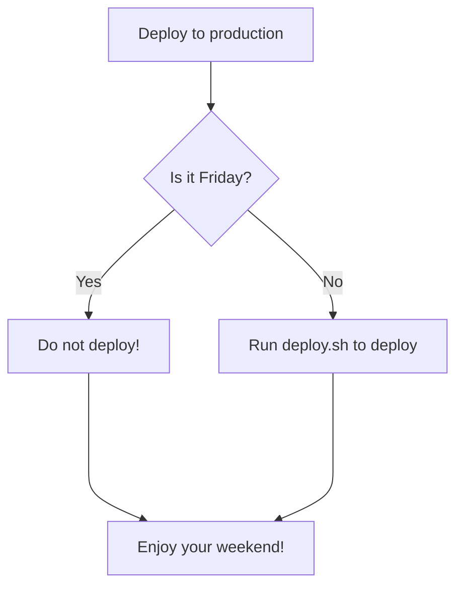

# HelloReact.Umbrella

[Source](https://betterprogramming.pub/phoenix-1-6-with-typescript-react-bea7f3a792d5)

# Mermaid

Mermaidjs Github intergration

```mermaid
flowchart TD
  A[Deploy to production] --> B{Is it Friday?};
  B -- Yes --> C[Do not deploy!];
  B -- No --> D[Run deploy.sh to deploy];
  C ----> E[Enjoy your weekend!];
  D ----> E[Enjoy your weekend!];
```
